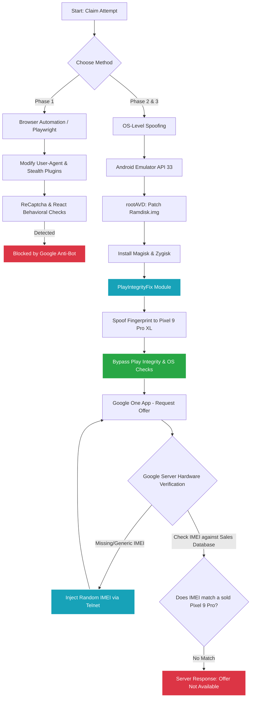

# 🕵️‍♂️ Reverse Engineering Google Gemini Pixel Offers

> [!WARNING]
> **DISCLAIMER: EDUCATIONAL PURPOSES ONLY**
> This repository is a Proof of Concept (PoC) documenting a reverse engineering experiment. This project is **NO LONGER MAINTAINED** and is archived. The methods described here may be patched by Google and will not work. Do not use this for malicious purposes.

## 📝 Overview
This repository contains scripts and documentation from an experiment attempting to automate and bypass Google's hardware verification for the Gemini Advanced Pixel 9 Pro promotion.

We explored two primary methods:
1. **Browser Automation:** Using Playwright and Stealth plugins to bypass browser-fingerprinting (Failed due to advanced React/ReCaptcha behavioral analysis).
2. **OS-Level Spoofing:** Downgrading an Android Emulator (API 33), patching Ramdisk via Magisk, and spoofing the OS Identity to a `Pixel 9 Pro XL` using PlayIntegrityFix.
3. **Hardware Spoofing:** Live injecting a Luhn-generated IMEI into the virtual modem via Telnet.

### 🏗️ Experiment Workflow Architecture

## 🛑 Why it failed (The Final Boss)
Despite fully spoofing the OS fingerprint and Play Integrity, Google's server-side verification checks the device's hardware identifiers (IMEI & Serial Number) against their **factory production and sales database**. 

Unless a valid, newly manufactured, and unsold Pixel 9 Pro IMEI is injected, the server will correctly reject the claim.

## 📚 Technical Learnings
- Playwright Stealth implementations
- Android API downgrades & AVD Ramdisk Kernel Patching
- Magisk / Zygisk root implementations
- Play Integrity API spoofing
- Live Modem RIL (Radio Interface Layer) Telnet manipulation

---
*Created for educational reverse-engineering purposes. Not intended for commercial use or exploitation.*
